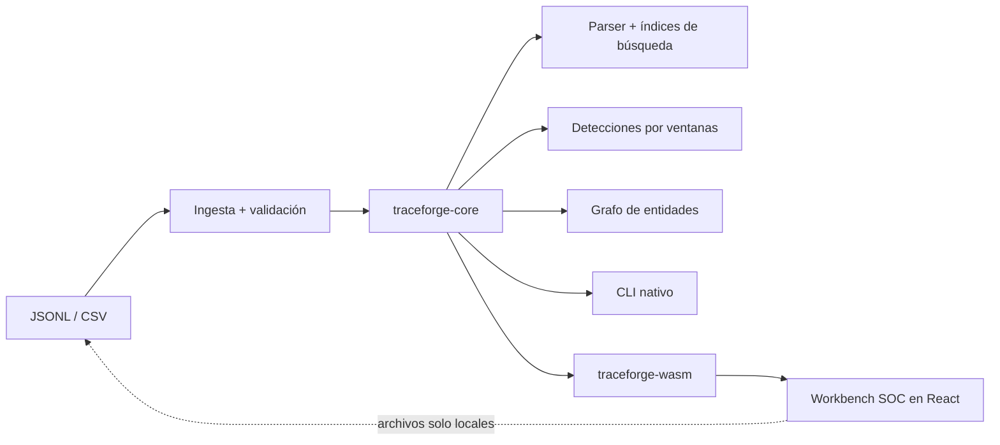

# TraceForge

**Workbench algorítmico y local para buscar logs y correlacionar eventos de seguridad.**

[English documentation](README.md) · [Arquitectura](docs/es/arquitectura.md) · [Lenguaje de consultas](docs/es/lenguaje-consultas.md) · [Benchmarks](docs/es/benchmarks.md) · [Privacidad](docs/es/privacidad.md)

TraceForge muestra las estructuras de datos que sostienen un pequeño motor de investigación. El mismo núcleo Rust funciona como CLI nativo y como WebAssembly dentro de un workbench React. Los archivos importados permanecen en el navegador: no hay backend, cuenta, telemetría ni almacenamiento remoto.

> Estado: candidato a `v0.1.0`. Todas las personas, equipos, direcciones e incidencias incluidas son sintéticas y deterministas.

## Qué demuestra

- Lexer, parser descendente recursivo y AST propios con precedencia `NOT > AND > OR`.
- Posting lists ordenadas con intersección, unión y diferencia lineales.
- Índice invertido, trie de prefijos explícito e índice temporal ordenado con búsqueda binaria.
- Grafos de entidades con listas de adyacencia, Union-Find, BFS y Dijkstra con heap indexado propio.
- Ventanas temporales mediante `VecDeque` y rankings top-k acotados con `BinaryHeap`.
- Reglas explicables de fuerza bruta, password spraying, fallos seguidos de éxito y movimiento lateral.
- Generación determinista, pruebas de equivalencia índice/escaneo y benchmarks locales registrados.
- Frontera WebAssembly tipada consumida por una interfaz React accesible en ES/EN.

## Arquitectura



| Paquete | Responsabilidad |
| --- | --- |
| `traceforge-core` | Contrato de eventos, ingesta, AST, índices, grafos, reglas y generador |
| `traceforge-cli` | Comandos `generate`, `build-index`, `query`, `detect`, `path` y `benchmark` |
| `traceforge-wasm` | Frontera serializable y límites web sin exponer colecciones internas |
| `web` | Workbench estático: consulta, timeline, tabla, incidentes, grafo e inspector algorítmico |

## Inicio rápido

Requisitos: Rust estable, objetivo `wasm32-unknown-unknown`, `wasm-pack`, Node.js y linker nativo C/C++.

```powershell
rustup target add wasm32-unknown-unknown
cargo install wasm-pack --locked
cargo test --workspace
cargo build --release -p traceforge-cli

./target/release/traceforge generate --count 10000 --seed 42 --scenario mixed --output ./eventos.jsonl
./target/release/traceforge build-index --input ./eventos.jsonl --output ./eventos.tfi
./target/release/traceforge query --index ./eventos.tfi --query 'outcome:failure AND user:ana'
./target/release/traceforge detect --index ./eventos.tfi
./target/release/traceforge path --index ./eventos.tfi --from user:ana --to host:dc-01 --mode risk
```

Interfaz web:

```powershell
wasm-pack build crates/traceforge-wasm --target web --release --out-dir ../../web/src/wasm-pkg
cd web
npm install
npm run dev
```

El paquete WASM generado se versiona para que Vercel no necesite Rust. El código Rust sigue siendo la fuente de verdad.

## Contrato de entrada

`EventRecord` contiene ID, timestamp UTC, fuente, tipo, usuario/equipo/IP opcionales, resultado, severidad, mensaje y atributos de texto opcionales. Si falta el ID se genera un fingerprint estable derivado de SHA-256. Las filas se ordenan por fecha e ID. La ingesta informa de filas inválidas e IDs duplicados; nunca los oculta.

- JSONL: un objeto `EventRecord` por línea.
- CSV: `id,timestamp,source,event_type,user,host,source_ip,outcome,severity,message,attributes_json`.
- Límite web: 50 MB y 100.000 eventos.
- CLI: escenarios en memoria reproducibles hasta 1.000.000 de eventos en el equipo documentado.

## Validación y resultados

Rustfmt, Clippy con warnings como error y 13 pruebas Rust pasan. ESLint, Vitest, auditoría npm sin vulnerabilidades y build de producción también pasan. Playwright define recorridos a 390, 768, 1440 y 1920 px.

La observación local del 07/08/2026 con semilla `42` abarcó de 1.000 a 1.000.000 de eventos. En 1M, construir el índice tardó 9,76 s; la consulta indexada promedió 41,85 ms frente a 10,22 s del escaneo lineal. La relación observada fue 244,16× para ese caso concreto. No es una promesa universal: consulta, CPU, iteraciones y resultados brutos están en [benchmarks](docs/es/benchmarks.md).

## Alcance y límites

La v1 no incorpora EVTX nativo, ingesta en tiempo real, almacenamiento remoto, reglas de proveedores, regex arbitrarias ni aprendizaje automático. El motor trabaja en memoria. La ruta ponderada usa `11 - severidad máxima` como coste; Dijkstra prioriza relaciones sospechosas fuertes, no rutas de red.

## Privacidad y licencia

Ningún evento importado se sube. La demo no tiene backend ni analítica. Todos los datasets son sintéticos. Licencia Apache 2.0; consulta [LICENSE](LICENSE) y [SECURITY.md](SECURITY.md).

