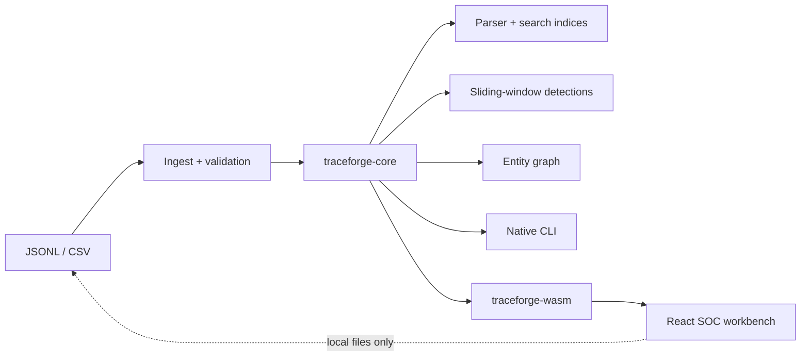

# TraceForge

**A local-first, algorithmic workbench for log search and security-event correlation.**

[Documentación en español](README.es.md) · [Architecture](docs/en/architecture.md) · [Query language](docs/en/query-language.md) · [Benchmarks](docs/en/benchmarks.md) · [Privacy](docs/en/privacy.md)

TraceForge is a portfolio project that makes the data structures behind a small investigation engine visible. The same Rust core runs as a native CLI and as WebAssembly in a React workbench. Imported files stay in the browser; there is no backend, account, telemetry or remote storage.

> Status: `v0.1.0` candidate. All included people, hosts, addresses and incidents are synthetic and deterministic.

## What it demonstrates

- A handwritten lexer, recursive-descent parser and AST with `NOT > AND > OR` precedence.
- Ordered posting lists with linear intersection, union and difference.
- An inverted index, explicit prefix trie and sorted temporal index with binary search.
- Entity graphs using adjacency lists, Union-Find, BFS and Dijkstra with a custom indexed min-heap.
- Sliding time windows with `VecDeque` and bounded top-k ranking with `BinaryHeap`.
- Explainable brute-force, password-spray, failure-then-success and lateral-movement rules.
- Deterministic data generation, index-vs-scan equivalence tests and recorded local benchmarks.
- A typed WebAssembly boundary consumed by an accessible ES/EN React interface.

## Architecture



| Package | Responsibility |
| --- | --- |
| `traceforge-core` | Event contract, ingestion, query AST, indices, graph algorithms, rules and generator |
| `traceforge-cli` | `generate`, `build-index`, `query`, `detect`, `path` and `benchmark` commands |
| `traceforge-wasm` | Serializable boundary and browser limits; no internal collections leak to TypeScript |
| `web` | Static Vite/React workbench; query, timeline, table, incidents, graph and algorithm inspector |

## Quick start

Requirements: Rust stable, the `wasm32-unknown-unknown` target, `wasm-pack`, Node.js and a native C/C++ linker.

```powershell
rustup target add wasm32-unknown-unknown
cargo install wasm-pack --locked
cargo test --workspace
cargo build --release -p traceforge-cli

./target/release/traceforge generate --count 10000 --seed 42 --scenario mixed --output ./events.jsonl
./target/release/traceforge build-index --input ./events.jsonl --output ./events.tfi
./target/release/traceforge query --index ./events.tfi --query 'outcome:failure AND user:ana'
./target/release/traceforge detect --index ./events.tfi
./target/release/traceforge path --index ./events.tfi --from user:ana --to host:dc-01 --mode risk
```

Run the web workbench:

```powershell
wasm-pack build crates/traceforge-wasm --target web --release --out-dir ../../web/src/wasm-pkg
cd web
npm install
npm run dev
```

The generated WASM package is committed so static hosts such as Vercel do not need a Rust toolchain. Rust source remains the source of truth.

## Query examples

```text
outcome:failure AND user:ana
host:ws-* OR severity:critical
NOT outcome:success AND type:authentication
message:"invalid password"
timestamp:[2026-07-30T08:00:00Z TO 2026-07-30T09:00:00Z]
```

Every successful query returns an execution plan with the chosen operator, candidate counts, estimated primitive operations and asymptotic complexity. See the complete [grammar and semantics](docs/en/query-language.md).

## Input contract

`EventRecord` contains an ID, UTC timestamp, source, event type, optional user/host/source IP, outcome, severity, message and optional string attributes. Missing IDs receive a stable SHA-256-derived fingerprint. Rows are sorted by timestamp and ID. Invalid rows and duplicate IDs are returned in the ingestion report rather than silently discarded.

- JSONL: one `EventRecord` JSON object per line.
- CSV: `id,timestamp,source,event_type,user,host,source_ip,outcome,severity,message,attributes_json`.
- Browser limit: 50 MB and 100,000 events.
- CLI: in-memory scenarios are reproducible up to 1,000,000 events on the recorded test machine.

## Verification

```powershell
cargo fmt --all -- --check
cargo clippy --workspace --all-targets -- -D warnings
cargo test --workspace
cd web
npm audit
npm run lint
npm test
npm run build
npm run test:e2e
```

Thirteen Rust tests currently cover parser precedence and errors, CSV/JSONL reporting, posting-list properties, index/linear-scan equivalence, deterministic generation, graph paths and all four detection types. The web suite covers component rendering and Playwright flows at 390, 768, 1440 and 1920 px.

## Measured benchmark snapshot

On 2026-08-07, seed `42`, Windows x86-64, 4 logical processors, Rust 1.97.1, query `outcome:failure AND user:ana`:

| Events | Index build | Indexed mean | Linear mean | Observed ratio |
| ---: | ---: | ---: | ---: | ---: |
| 1,000 | 10.93 ms | 24.91 µs | 322.22 µs | 12.93× |
| 10,000 | 99.94 ms | 241.73 µs | 3.81 ms | 15.78× |
| 100,000 | 1.17 s | 3.39 ms | 35.37 ms | 10.44× |
| 1,000,000 | 9.76 s | 41.85 ms | 10.22 s | 244.16× |

These are local observations, not universal performance claims. Raw JSON, iteration counts, methodology and caveats live in [`benchmark-results/raw`](benchmark-results/raw) and [the benchmark guide](docs/en/benchmarks.md).

## Scope and limits

Version 1 deliberately excludes native EVTX parsing, real-time ingestion, remote storage, vendor rule packs, arbitrary regex and machine learning. The engine works in memory. The risk-weighted path uses `11 - max severity` as edge cost, so Dijkstra favours stronger suspicious relationships; it is not a network routing metric.

## Security and privacy

No imported event is uploaded. The deployed application has no backend or analytics. Web limits are enforced at the WASM boundary. Included datasets are synthetic. Please report vulnerabilities according to [SECURITY.md](SECURITY.md).

## License

Apache License 2.0. See [LICENSE](LICENSE).

